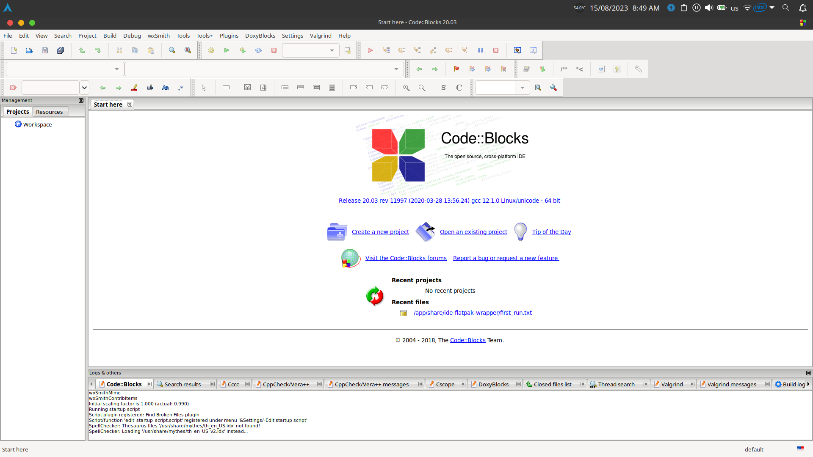
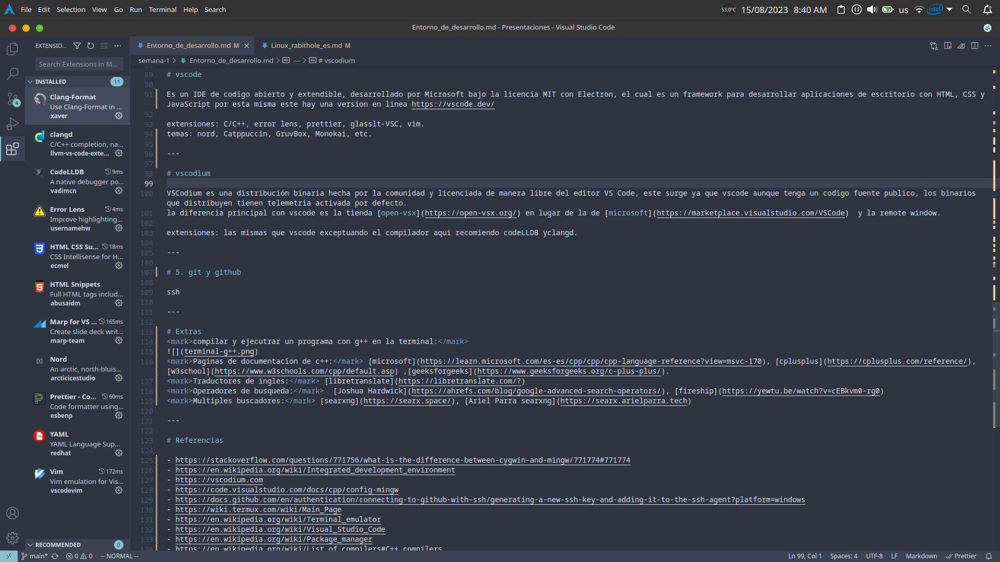
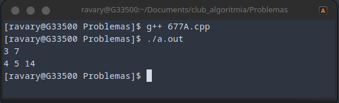

# <!--fit--> Entorno de desarrollo en c++
## Por Ariel Parra.

---

<!-- tema -->

# <mark> 1. terminales</mark>

---
Un emulador de terminal permite al usuario acceder todas las  aplicaciones del sistema operativo con interfaces de text, en ingles command-line interfaces (CLI) o text user interface (TUI) applications.
En nuestro caso es donde correremos el compilador y ejecutaremos nuestros algortimos.

<mark>CMD/PowerShell:</mark> son las terminales ya incluidas con Windows.
<mark>PowerShell v7:</mark> es la nueva version opensource de powershell. 
<mark>git bash:</mark> es una capa de compatibilidad de la terminal de linux en Windows.
<mark>windows terminal:</mark> es una terminal con pestañas para Windows.
<mark>alacritty:</mark>es una terminal protable y configurable que usa acelaracion de hardware. 
<mark>termux:</mark> es una terminal conmpatible con Linux sin root para Android.
<mark>ish:</mark> es un emulador del sistema operativo alpine linux para dispositivos iOS.

---

# <mark>2.Package managers</mark>

---

Un gestor de paquetes es una colección de herramientas de software que automatizan el proceso de instalación, actualización, configuración y eliminación de programas en una computadora. En nuestro caso nos puede ayudar a instalar el IDE y el compilador.

<mark>Windows:</mark> scoop, winget.
<mark>MacOSX:</mark> homebrew.
<mark>Linux:</mark> apt, pacman, etc.
<mark>iOS:</mark> apk (ish).
<mark>Android:</mark> pkg (termux).

---

# <mark>3. compiladores</mark>

---

<mark>g++:</mark> es el compilador de c++ del proyecto GNU, este es de codigo abierto y es portable, por lo que es el que usaremos en el curso.
Para windows hay dos opciones principales, MIngw64 o g++ bajo linux con WSL.

<mark>Clang/LLVM:</mark> es un compilador de codigo abierto, altamente optimizado, dice ser compatible con MSV y gcc aunque este tiene toda una infraestructura distinta.

<mark>MSVC C++:</mark> es el compilador propietario de Microsoft, por lo que ocupas una licencia para usarlo, esta echo especificamente para su IDE Vstudio y enfocado solamente para Windows.

<mark>oneAPI DPC++/C++:</mark> es el compilador propietario de Intel, por lo que ocupas una licencia para usarlo y esta enfocado en sus procesadores de servidor Xeon.

<mark>AOCC:</mark> es el compilador propietario de AMD, por lo que ocupas una licencia para usarlo y esta enfocado en sus procesadores "zen".

---

# 4. IDEs

Integrated development environment o en español Entorno de desarrollo integrado. Contienen indicadores visuales de codigo erroneo, debug, sintaxis, cambios, entre otras muchas funciones que no tendrias en un bloc de notas convencional.

---

# Code::Blocks

Es un IDE de codigo abierto, con extensibilidad de plugins, la ventaja de este es que ya tiene funciones tales como:
- Destacado sintaxis
- Finalización de Código
- Navegador de clase
- Indentado automatico
- Intercambio rapido entre archivos .h y .c/.cpp
- Gestión de listas con diferentes usuarios

---

# vscode

Es un IDE de codigo abierto, extendible e integrado con git, desarrollado por Microsoft bajo la licencia MIT con Electron, el cual es un framework para desarrollar aplicaciones de escritorio con HTML, CSS y JavaScript por esto mismo, hay una version en linea https://vscode.dev/

extensiones: C/C++, error lens, prettier, glasslt-VSC, vim.
temas: nord, Catppuccin, GruvBox, Monokai, etc.

instalar el compilador de g++ en vscode: 

---

# vscodium

VSCodium es una distribución binaria hecha por la comunidad y licenciada de manera libre del editor VS Code, este surge ya que vscode aunque tenga un codigo fuente publico, los binarios que distribuyen tienen telemetria activada por defecto.
la diferencia principal con vscode es la tienda [open-vsx](https://open-vsx.org/) en lugar de la de [microsoft](https://marketplace.visualstudio.com/VSCode)  y la remote window. 

extensiones: las mismas que vscode exceptuando el compilador aqui recomiendo codeLLDB yclangd.

---

# <mark>5. git y Github</mark>

---

Git es una herramienta de control de version distribuido mientras que GitHub es una plataforma y servicio basado en la nube de Microsoft para el desarrollo de software y el control de versiones utilizando Git, basicamente un servidor donde almacenas tu codigo y lo controlas con Git. 

Primero crearemos una cuenta de github https://github.com/signup

---

# Extras
<mark>compilar y ejecutrar en la terminal:</mark>

<mark>Paginas de documentacion de c++:</mark> [microsoft](https://learn.microsoft.com/es-es/cpp/cpp/cpp-language-reference?view=msvc-170), [cplusplus](https://cplusplus.com/reference/), [w3school](https://www.w3schools.com/cpp/default.asp) ,[geeksforgeeks](https://www.geeksforgeeks.org/c-plus-plus/).
<mark>Traductores de ingles:</mark> [libretranslate](https://libretranslate.com/?)
<mark>Operadores de busqueda:</mark>  [Joshua Hardwick](https://ahrefs.com/blog/google-advanced-search-operators/), [fireship](https://yewtu.be/watch?v=cEBkvm0-rg0)
<mark>Multiples buscadores:</mark> [searxng](https://searx.space/), [Ariel Parra searxng](https://searx.arielparra.tech)

---

# Referencias

- https://stackoverflow.com/questions/771756/what-is-the-difference-between-cygwin-and-mingw/771774#771774
- https://en.wikipedia.org/wiki/Integrated_development_environment
- https://vscodium.com
- https://code.visualstudio.com/docs/cpp/config-mingw
- https://docs.github.com/en/authentication/connecting-to-github-with-ssh/generating-a-new-ssh-key-and-adding-it-to-the-ssh-agent?platform=windows
- https://wiki.termux.com/wiki/Main_Page
- https://en.wikipedia.org/wiki/Terminal_emulator
- https://en.wikipedia.org/wiki/Visual_Studio_Code
- https://en.wikipedia.org/wiki/Package_manager
- https://en.wikipedia.org/wiki/List_of_compilers#C++_compilers
- https://git-scm.com/
- https://en.wikipedia.org/wiki/GitHub